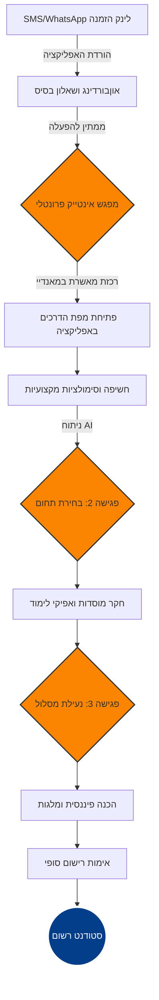
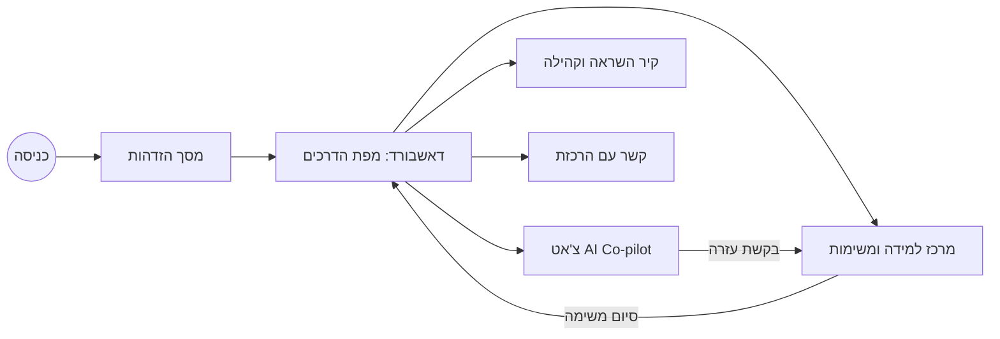
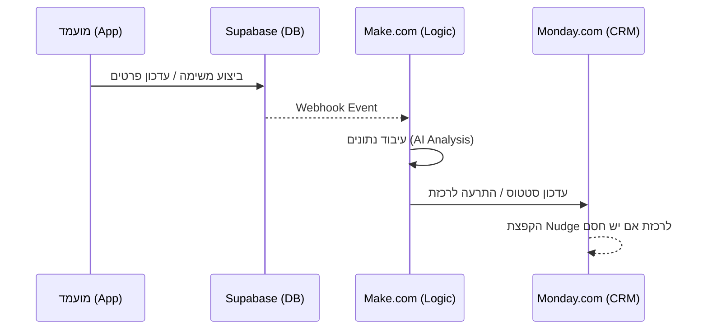

# אפיון טכני ותרשימי זרימה - פרויקט טק-קריירה 2026

מסמך זה מכיל את תרשימי הזרימה של המערכת. ניתן לצפות בהם גרפית ב-VS Code באמצעות התוסף Mermaid Editor.

---

## 1. תרשים המסע ההיברידי (Hybrid Journey)

תרשים זה מתאר את 6 השלבים שהמועמד עובר, מהרישום ועד להפיכתו לסטודנט.

---

## 2. מבנה המסכים באפליקציה (App Architecture)

זרימת המשתמש בין המסכים השונים בתוך ה-Web App.

---

## 3. ארכיטקטורת נתונים (Data Flow)

איך המידע עובר מהאפליקציה של המועמד אל הרכזת במאנדיי.

---

## 4. לוגיקת ה-AI (Nudge Logic)

מתי המערכת מחליטה להקפיץ התרעה לרכזת.

| טריגר (Trigger) | פעולת ה-AI | תוצאה במאנדיי |
|---|---|---|
| חוסר פעילות > 72 שעות | זיהוי "Stagnation" | שינוי סטטוס ל-"At Risk" |
| כישלון במשימה 3 פעמים | זיהוי "Technical Barrier" | יצירת משימה דחופה לרכזת |
| מילות תסכול בצ'אט | ניתוח סנטימנט שלילי | התרעת "Manual Intervention Required" |
